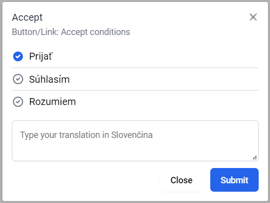

# 👽 Inline translations for FBT




## ℹ️ Usage notes

- this library requires FBT for PHP:
  - [FBT for Laravel (v5.5+)](https://github.com/richardDobron/laravel-fbt)
  - [FBT for PHP (v7.0+)](https://github.com/richardDobron/fbt)

## 📦 Installing

```
npm install fbt-inline-translations
```

## 🔧 Configuration

Register your FBT project on [Swiftyper Translations](https://translations.swiftyper.sk)


### Non-React usage

Add this code to page your page:

```html
<div id="inline-translator"></div>

<script src="https://cdn.jsdelivr.net/npm/fbt-inline-translations/dist/bundle.js"></script>
<script>
    swiftyperInlineTranslations({
        token: 'YOUR_API_KEY_HERE',
        locale: 'sk_SK', // translation locale
        contributor: 'contributor@email.com', // contributor must be invited
        darkMode: false, // dark mode also depends on html class 'dark'
    })
</script>
```